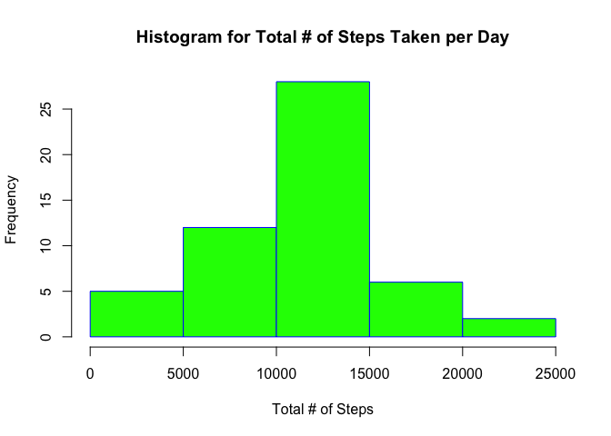
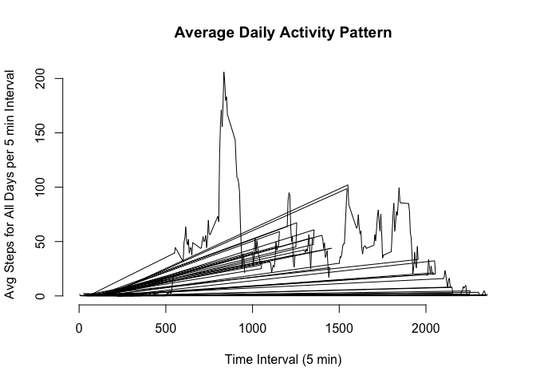
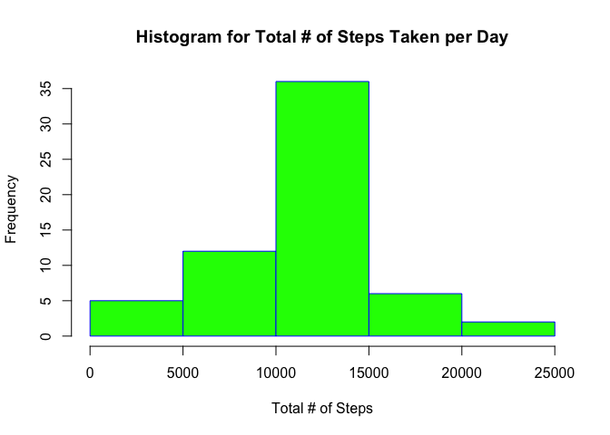
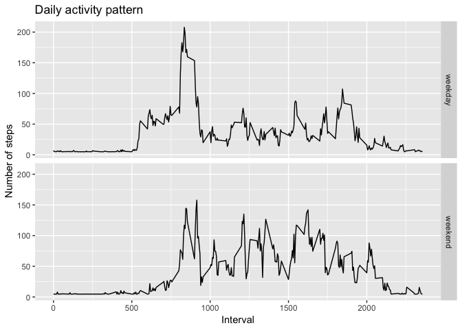

## Loading and preprocessing the data
#---------------------------------------------------------------------------------------------------

###Downloading zip file containing data and reading data

```r
zipUrl <- "https://d396qusza40orc.cloudfront.net/repdata%2Fdata%2Factivity.zip"
zipFile <- "activity.zip"

if (!file.exists(zipFile)) {
        download.file(zipUrl, zipFile, mode = "wb")
}
```
### Unzipping file if directory doesn't exist

```r
dataPath <- "activity"
if (!file.exists(dataPath)) {
        unzip(zipFile)
}
```
### Reading file into a data frame

```r
data <- read.csv(file.path("activity.csv"), sep = ",", header = TRUE, colClasses = c("numeric","character","character"))
```

### Removing incomplete cases for next part of the assignment

```r
completeData <- data[complete.cases(data), ]
```
## What is mean total number of steps taken per day?

### First we calculate the total sum per day 

```r
totalSums <- aggregate(completeData$steps, by = list(date = completeData$date), FUN=sum)
```
### Histogram of Total # of Steps Taken per Day

```r
hist(totalSums$x, 
     main="Histogram for Total # of Steps Taken per Day", 
     xlab="Total # of Steps", 
     border="blue", 
     col="green")
```

<!-- -->

### Calculating/Reporting Mean/Median of Total # of Steps Taken per Day

```r
meanTotal <- mean(totalSums$x)
medianTotal <- median(totalSums$x)
```

```
## [1] "Mean of Total # of Steps Taken per Day: 10766.1886792453"
```

```
## [1] "Median of Total # of Steps Taken per Day: 10765"
```

## What is the average daily activity pattern?

### Plotting Average Daily Activity

```r
avgDailyActivity <- aggregate(completeData$steps, by = list(interval = completeData$interval), FUN=mean)
plot(avgDailyActivity$interval, avgDailyActivity$x, type = "l", axes = F, 
     xlab = "Time Interval (5 min)", ylab = "Avg Steps for All Days per 5 min Interval", main = "Average Daily Activity Pattern")
axis(2)
axis(1)
```

<!-- -->

### Finding the 5 minute interval, on average across all days, which contains the maximum number of steps

```r
maxInterval <- avgDailyActivity[max(avgDailyActivity$x),]
print(paste0("Max Interval: ", maxInterval$interval))
```

```
## [1] "Max Interval: 335"
```
## Imputing missing values

### Calculating/Reporting total number of missing values

```r
sumTotal <- sum(is.na(data))
print(paste0("Total Number of Missing Values: ", sumTotal))
```

```
## [1] "Total Number of Missing Values: 2304"
```

### Imputing Missing Values by Mean of All Steps

```r
imputed_Data <- data
imputed_Data$steps[is.na(imputed_Data$steps)] <- mean(imputed_Data$steps, na.rm = TRUE)
```

### Histogram of Total Steps Taken; Mean & Median of Total Steps Taken per Day

```r
totalSumsCompletedData <- aggregate(imputed_Data$steps, by = list(date = imputed_Data$date), FUN=sum)
hist(totalSumsCompletedData$x, 
     main="Histogram for Total # of Steps Taken per Day", 
     xlab="Total # of Steps", 
     border="blue", 
     col="green")
```

<!-- -->

```r
meanTotalComplete <- mean(totalSumsCompletedData$x)
medianTotalComplete <- median(totalSumsCompletedData$x)
print(paste0("Mean of Total # of Steps Taken per Day: ", meanTotalComplete))
```

```
## [1] "Mean of Total # of Steps Taken per Day: 10766.1886792453"
```

```r
print(paste0("Median of Total # of Steps Taken per Day: ", medianTotalComplete))
```

```
## [1] "Median of Total # of Steps Taken per Day: 10766.1886792453"
```

### Analysis
- The mean and median of the data with the imputed values differ slightly from the original dataset with missing values. 
- The inclusion of the average of all steps as the imputed value for all missing values denoted by 'NA' is that the median and mean both increased slightly for the distribution. 

## Are there differences in activity patterns between weekdays and weekends?

### Creating a factor variable for weekends vs weekday

### Splitting the data set into weekday/weekend

```r
imputed_Data$Date <- as.Date(imputed_Data$date, format="%Y-%m-%d")
week <- factor(weekdays(imputed_Data$Date) %in% c("Saturday","Sunday"), 
                labels=c("weekday","weekend"), ordered=FALSE)
imputed_Data2 <- aggregate(imputed_Data$steps, by=list(interval=imputed_Data$interval, weekday=week), mean)
library(ggplot2)
g <- ggplot(imputed_Data2, aes(as.numeric(interval), x))
  g + geom_line() + facet_grid(weekday ~ .) +
     labs(y="Number of steps") +
     labs(x="Interval") +
     labs(title="Daily activity pattern")
```

<!-- -->


